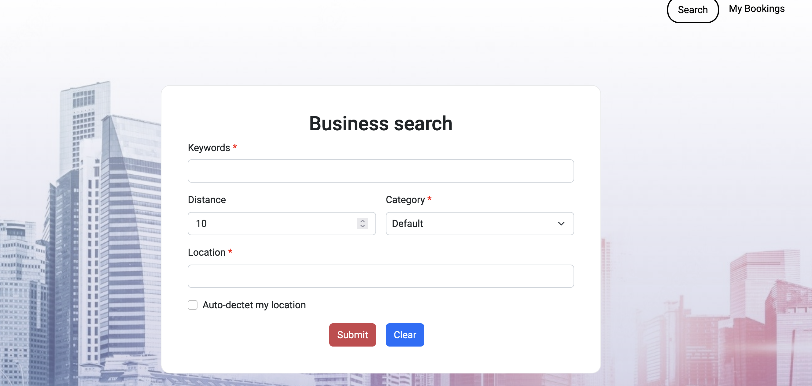
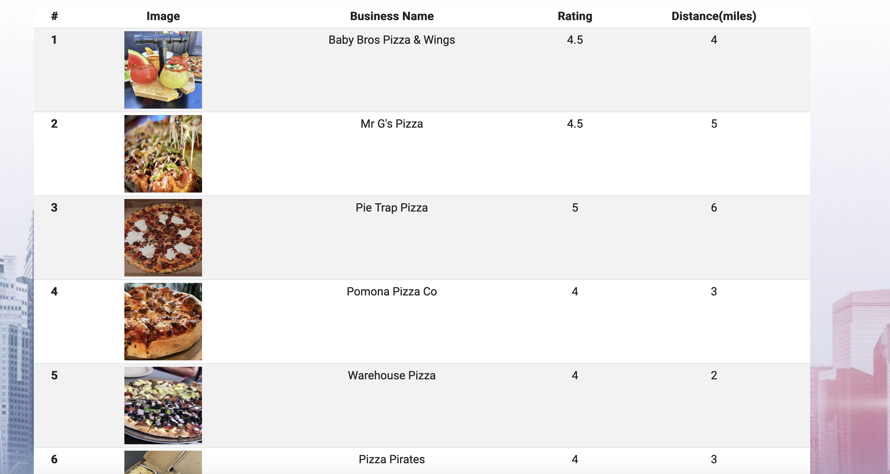
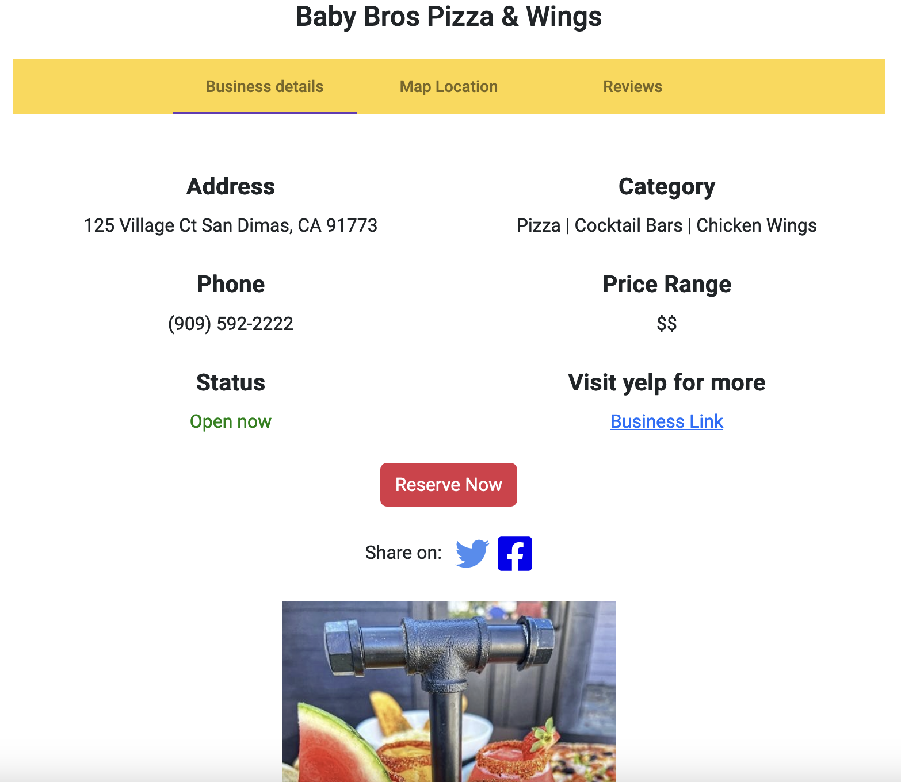

# Business and Service Search Engine

### Description:
The Business and Service Search Engine is a powerful web and mobile application designed to simplify the process of finding businesses and services near your location or any desired area. With an intuitive user interface and advanced search capabilities, this innovative search engine provides a seamless and efficient search experience across both web and mobile platforms.

### Key Features:
- Effortless search: Enter keywords, distance, category, and location to find the most relevant businesses and services.
- Auto-detect location: Automatically detects and uses your current location for convenient searching.
- Intelligent search capabilities: Keyword autocompletion and advanced filters streamline the search process.
- Comprehensive results: Get essential information such as images, ratings, and distances of services and locations.
- Detailed business information: Access in-depth details like addresses, phone numbers, price ranges, opening hours, and reviews.
- Reservation feature: Make reservations directly from the detail page and manage them in the My Bookings section.

### Technical Overview:
- Web Frontend: Developed using Angular Framework and Bootstrap for a responsive, mobile-first design.
- Backend Infrastructure: Powered by Node.js Express framework with APIs to retrieve and organize business data.
- Web Deployment: Seamlessly deployed using Google Cloud Platform App Engine.
- iOS Frontend: Built with SwiftUI and Xcode, ensuring a consistent user experience.
